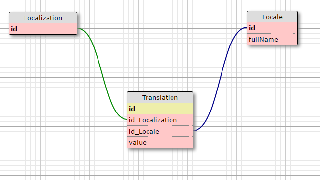

# nodejs-localization-service [](https://travis-ci.com/mikkopiu/nodejs-localization-service)

Simple localization service with a REST API and a management web UI.

Uses PostgreSQL as its database. The REST API and web UI is built on Node.js, using Sequelize.

Based on this wonderful example: https://github.com/sequelize/express-example

## Running

Start up Postgres and the service.

```shell
docker-compose up -d
```

The API is available at `http://localhost:3000` by default.
It is recommended that you add a reverse proxy in front of the API.

### Configuration

Available options (as environment variables):

+-------------------+-------------+--------------------------------+
| Variable          | Default     | Description                    |
+-------------------+-------------+--------------------------------+
| `NODE_ENV`        | `undefined` |                                |
+-------------------+-------------+--------------------------------+
| `PORT`            | `3000`      | Port the app will listen on    |
+-------------------+-------------+--------------------------------+
| `APP_DB_NAME`     | `postgres`  | The name of the database       |
+-------------------+-------------+--------------------------------+
| `APP_DB_USER`     | `null`      | Username to access database    |
+-------------------+-------------+--------------------------------+
| `APP_DB_PASSWORD` | `null`      | Password to access database    |
+-------------------+-------------+--------------------------------+
| `APP_DB_HOST`     | `db`        | Hostname of database           |
+-------------------+-------------+--------------------------------+
| `APP_DB_DIALECT`  | `postgres`  | Sequelize dialect for database |
+-------------------+-------------+--------------------------------+

Database configuration is done using the `config/config.json` file.

### Logging

```shell
docker-compose logs
```

## Development

Run tests and linting:
```shell
npm test
```

## Database's (rough) schema


